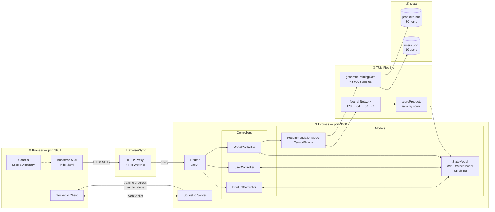
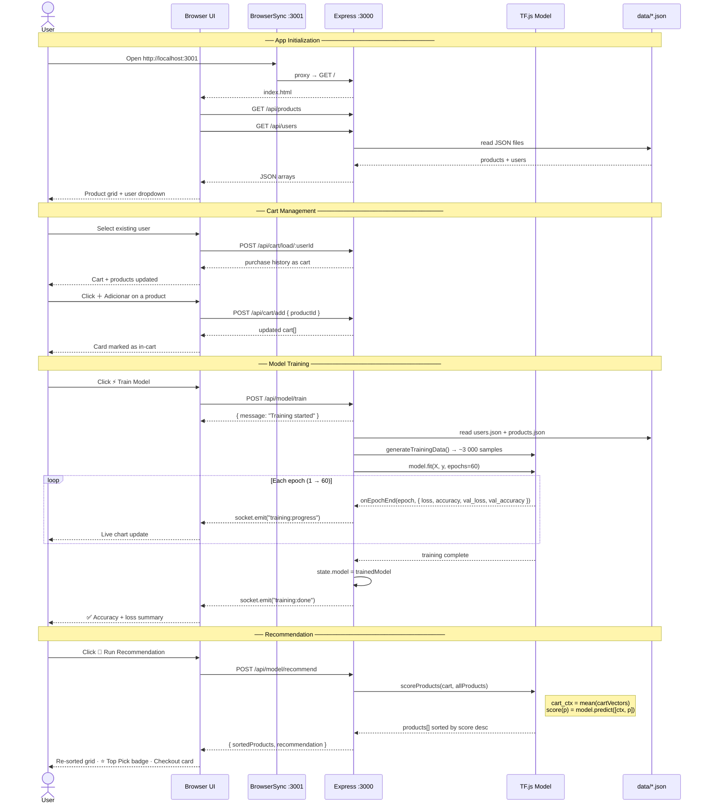

# RecomAI — Product Recommendation System

A full-stack product recommendation engine built with **TensorFlow.js**, **Node.js** and **Socket.io**. The neural network learns from real user purchase histories and recommends products in real time based on the current shopping cart.

---

## Demo

| Step | What happens |
|------|-------------|
| Select a user (or start fresh) | Cart loads from purchase history |
| Add products to cart | Products marked as selected |
| **⚡ Train Model** | 60-epoch training with live loss/accuracy charts |
| **🎯 Run Recommendation** | Product grid re-sorts by score · Top pick highlighted · Checkout card shows best match |

---

## Features

- **Neural Collaborative Filtering** — pairwise model trained on co-purchase patterns
- **~3 000 training samples** generated from 10 users via combinatorial subset augmentation
- **Live training charts** — loss and accuracy update epoch-by-epoch via Socket.io
- **Real-time product ranking** — sorted by recommendation score after each inference run
- **BrowserSync** — auto-reloads the browser on view/asset changes during development
- **MVC architecture** — clean separation between models, controllers, routes and views

---

## Tech Stack

| Layer | Technology |
|-------|-----------|
| ML | TensorFlow.js (`@tensorflow/tfjs`) |
| Backend | Node.js · Express · Socket.io |
| Frontend | Bootstrap 5 · Chart.js 4 · vanilla JS |
| Dev tooling | BrowserSync · Nodemon |

---

## Architecture

### Component Diagram



### Folder Structure

```
RecomAI/
├── app.js                    # Entry point — Express + Socket.io + BrowserSync
├── routes/
│   └── index.js              # All API route bindings
├── controllers/
│   ├── productController.js  # GET /api/products (sorted when model is trained)
│   ├── userController.js     # Cart management & user loading
│   └── modelController.js   # Train + recommend endpoints
├── models/
│   ├── stateModel.js         # In-memory state (cart, trained model)
│   └── recommendationModel.js # TF.js model: build · train · score
├── data/
│   ├── products.json         # 30 products across 6 categories
│   └── users.json            # 10 users with coherent purchase histories
└── views/
    └── index.html            # Single-page UI
```

---

## How the Model Works

### Feature Engineering

Each product is encoded as an **18-dimensional vector**:

```
[ category (6d one-hot) | normalized price (1d) | color (11d one-hot) ]
```

### Training Data Generation

For each of the 10 users with N purchases, every subset of size k (k = 1 … N−1) is used as a "cart context":

- **Positive samples** → remaining purchased products (label = 1)
- **Negative samples** → 3 × random un-purchased products (label = 0)

This yields **~3 000 balanced training samples** from just 10 users.

### Model Architecture

```
Input(36) ──► Dense(128, ReLU) ──► BatchNorm ──► Dropout(0.3)
          ──► Dense(64,  ReLU) ──► Dropout(0.2)
          ──► Dense(32,  ReLU)
          ──► Dense(1,   Sigmoid)   → purchase probability
```

- **Input:** `concat(cart_context_vector, candidate_product_vector)` = 36 dims  
- **Output:** probability that the candidate product pairs well with the current cart  
- **Optimizer:** Adam (lr = 0.001) · **Loss:** Binary Cross-Entropy · **Epochs:** 60

### Inference

```
cart_context = mean(feature_vectors of cart items)
score(p)     = model.predict([cart_context, feature_vector(p)])
ranking      = products sorted by score descending (cart items pushed to bottom)
```

---

## Sequence Diagram



---

## Getting Started

### Prerequisites

- Node.js ≥ 18

### Install & Run

```bash
git clone https://github.com/csaantana/RecomAI.git
cd RecomAI
npm install
npm start
```

The app opens automatically at **http://localhost:3001** (BrowserSync with auto-reload).  
The API server runs at **http://localhost:3000**.

---

## API Reference

| Method | Endpoint | Description |
|--------|----------|-------------|
| `GET` | `/api/products` | List all products (sorted by score when model is active) |
| `GET` | `/api/users` | List all users |
| `GET` | `/api/cart` | Current cart contents |
| `POST` | `/api/cart/add` | Add product `{ productId }` |
| `DELETE` | `/api/cart/:id` | Remove product from cart |
| `POST` | `/api/cart/clear` | Empty the cart |
| `POST` | `/api/cart/load/:userId` | Load a user's purchase history as cart |
| `POST` | `/api/model/train` | Start training (progress streamed via Socket.io) |
| `POST` | `/api/model/recommend` | Score all products and return top recommendation |

### Socket.io Events

| Event | Payload |
|-------|---------|
| `training:progress` | `{ epoch, totalEpochs, loss, accuracy, valLoss, valAccuracy }` |
| `training:done` | `{ sampleCount, finalLoss, finalAccuracy }` |
| `training:error` | `{ message }` |

---

## Dataset

### Products (30 items · 6 categories)

`Electronics` · `Clothing` · `Sports` · `Home` · `Beauty` · `Books`

Each product has: `id · name · category · price · color`

### Users (10 profiles with coherent purchase patterns)

| User | Profile | Purchased |
|------|---------|-----------|
| Alex | Tech Worker | Notebook, Mouse, Keyboard, USB Hub, Webcam |
| Jordan | Gamer | Gaming Headset, Mouse, Keyboard, Monitor, USB Hub |
| Maria | Fitness | Running Shoes, Sports Shirt, Water Bottle, Yoga Mat, Dumbbells |
| Sofia | Fashion | Dress, Heels, Handbag, Sunglasses, Lipstick |
| Lucas | Student | Clean Code, Desk Lamp, USB Hub, Atomic Habits, Speaker |
| Chef Paulo | Home Cook | Chef Knife, Cast Iron, Cutting Board, Coffee Maker, Desk Lamp |
| Ana | Wellness | Running Shoes, Sports Shirt, Water Bottle, Vitamin C, Moisturizer |
| Rafael | Tech + Study | Notebook, Monitor, Clean Code, Atomic Habits, Desk Lamp |
| Pedro | Outdoor | Hiking Backpack, Water Bottle, Running Shoes, Shorts, Jump Rope |
| Isabella | Fashion + Beauty | Dress, Sunglasses, Vitamin C, Lipstick, Moisturizer |

User clusters (Tech, Sports, Fashion+Beauty) intentionally overlap to give the model strong collaborative signals.

---

## License

MIT
