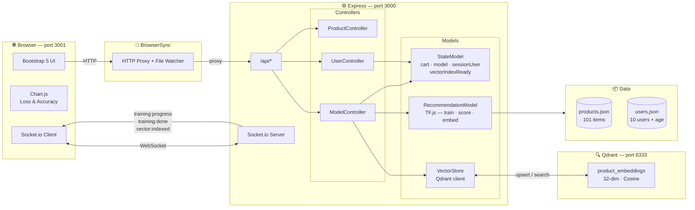
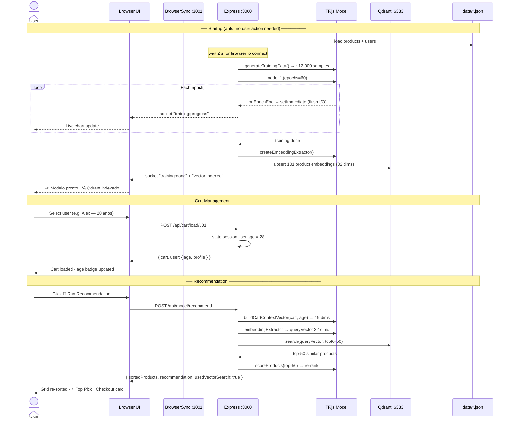

# RecomAI — Product Recommendation System

A full-stack product recommendation engine powered by **TensorFlow.js** and **Qdrant** (vector database). The neural network learns co-purchase patterns from 10 user profiles and recommends products in real time through a two-stage pipeline: fast ANN search on Qdrant followed by neural re-ranking.

---

## How it works at a glance

```
npm start
  └─ server boots
  └─ waits 2 s (browser connects via BrowserSync)
  └─ auto-trains neural network (60 epochs, live charts)
  └─ extracts 32-dim embeddings → indexes all products in Qdrant

Select a user (or build a custom cart) → Run Recommendation
  └─ Stage 1: cart embedding → Qdrant ANN search → top-50 candidates
  └─ Stage 2: full model re-ranks the 50 candidates
  └─ Product grid re-sorts · ⭐ Top Pick badge · Checkout recommendation card
```

No retraining needed when changing users or cart — the model runs **inference only**.

---

## Features

- **Auto-train on startup** — model trains once; all subsequent sessions use inference only
- **Two-stage retrieval** — Qdrant ANN (milliseconds) + neural re-rank (precision)
- **Age as a feature** — user age is the last dimension of the cart context vector, letting the model capture age-group preferences
- **Live training charts** — loss and accuracy animate epoch-by-epoch via Socket.io
- **Late-connect resilience** — page refresh or mid-training join replays full epoch history
- **Graceful fallback** — if Qdrant is offline, scoring runs directly over all 101 products
- **MVC architecture** — clean separation of routes, controllers, models and views

---

## Tech Stack

| Layer | Technology |
|-------|-----------|
| ML | TensorFlow.js (`@tensorflow/tfjs`) |
| Vector DB | Qdrant (Docker) |
| Backend | Node.js · Express · Socket.io |
| Frontend | Bootstrap 5 · Chart.js 4 · vanilla JS |
| Dev tooling | BrowserSync · Nodemon · Docker Compose |

---

## Architecture

### Component Diagram



### Folder Structure

```
RecomAI/
├── docker-compose.yml            # Qdrant container (port 6333)
├── app.js                        # Entry point — Express + Socket.io + BrowserSync
├── routes/index.js               # All API route bindings
├── controllers/
│   ├── productController.js      # GET /api/products (sorted when model active)
│   ├── userController.js         # Cart CRUD + session user age sync
│   └── modelController.js        # Train · recommend · Qdrant indexing
├── models/
│   ├── stateModel.js             # Shared in-memory state (singleton)
│   ├── recommendationModel.js    # TF.js: feature engineering, training, inference
│   └── vectorStore.js            # Qdrant: index products, search similar
├── data/
│   ├── products.json             # 101 products across 6 categories
│   └── users.json                # 10 users with age, profile, 12-14 purchases
└── views/index.html              # Single-page Bootstrap UI
```

---

## How the Model Works

### Feature Engineering

**Product vector — 18 dims:**
```
[ category (6d one-hot) | price normalized (1d) | color (11d one-hot) ]
```

**Cart context vector — 19 dims:**
```
[ mean of product vectors (18d) | user age / 100 (1d) ]
```
Age is the last dimension. It lets the model capture age-group purchasing patterns (e.g. younger users lean toward electronics, older toward home & cooking).

**Model input — 37 dims:**
```
concat( cart_context_vector[19] , candidate_product_vector[18] )
```

### Training Data Generation

For each user with N purchases, every subset of size k (capped at **k ≤ 4** and **≤ 12 sampled subsets** per size) is used as a simulated cart context:

- **Positive pair** → product the user actually bought (label = 1)
- **Negative pair** → 3 × random unrelated products (label = 0)

The caps prevent combinatorial explosion: `C(14, 7) = 3 432` subsets per size would make training stall. With the limits, the dataset stays at **~10–15k balanced samples** — fast enough for the pure-JS TF.js backend.

### Model Architecture

```
Input(37) ──► Dense(128, ReLU) ──► BatchNorm ──► Dropout(0.3)
          ──► Dense(64,  ReLU) ──► Dropout(0.2)
          ──► Dense(32,  ReLU)  ◄── "embedding_layer" (used by Qdrant)
          ──► Dense(1,  Sigmoid) → purchase probability
```

- **Optimizer:** Adam (lr = 0.001)  
- **Loss:** Binary Cross-Entropy  
- **Epochs:** 60 · **Batch size:** 32 · **Validation split:** 20 %

### Two-Stage Inference with Qdrant

After training, a sub-model (`embeddingExtractor`) is created from the same weights, returning the 32-dim output of `embedding_layer` instead of the final probability.

```
POST-TRAINING — indexing (runs once):
  for each product p:
    input = [zeros(19), productFeatures(18)]   ← empty cart context
    embedding_p = embeddingExtractor.predict(input)   → 32 dims
    qdrant.upsert(id=p.id, vector=embedding_p, payload=p)

INFERENCE — recommend (runs on every request):
  Stage 1 — Retrieval (ANN, O(log n)):
    cartContext = buildCartContextVector(cart, userAge)   → 19 dims
    queryInput  = [...cartContext, ...zeros(18)]          → 37 dims
    queryEmbed  = embeddingExtractor.predict(queryInput)  → 32 dims
    candidates  = qdrant.search(queryEmbed, topK=50)

  Stage 2 — Re-rank (neural, O(50)):
    for each candidate:
      score = fullModel.predict([cartContext, productFeatures])
    sort by score desc
```

---

## Sequence Diagram



---

## Getting Started

### Prerequisites

- Node.js ≥ 18
- Docker Desktop (for Qdrant)

### Install & Run

```bash
git clone https://github.com/csaantana/RecomAI.git
cd RecomAI

# 1. Start Qdrant
docker-compose up -d

# 2. Install dependencies
npm install

# 3. Start the app
npm start
```

The browser opens automatically at **http://localhost:3001** (BrowserSync, auto-reload).  
The API server runs at **http://localhost:3000**.  
Qdrant dashboard: **http://localhost:6333/dashboard**

### Startup sequence

| Time | What happens |
|------|-------------|
| 0 s | Express + Socket.io start on port 3000 |
| ~0.5 s | BrowserSync proxy starts on port 3001, opens browser |
| 2 s | Auto-training begins (live charts animate) |
| ~2–3 min | Training complete · Qdrant indexed · UI unlocks |

> **No retraining needed.** Change users or cart freely — only inference runs.

---

## API Reference

### REST endpoints

| Method | Endpoint | Description |
|--------|----------|-------------|
| `GET` | `/api/products` | Catalog (sorted by score when model + cart active) |
| `GET` | `/api/users` | All 10 users with age, profile and purchase history |
| `GET` | `/api/cart` | Current cart |
| `POST` | `/api/cart/add` | Add product `{ productId }` |
| `DELETE` | `/api/cart/:id` | Remove product |
| `POST` | `/api/cart/clear` | Empty cart, reset to guest user (28 y/o) |
| `POST` | `/api/cart/load/:userId` | Load user history as cart, sync age |
| `POST` | `/api/model/train` | Manual retrain (optional) |
| `POST` | `/api/model/recommend` | Two-stage recommendation: Qdrant ANN → neural re-rank |

### Socket.io events (server → client)

| Event | Payload | When |
|-------|---------|------|
| `training:start` | `{ totalEpochs }` | Training begins |
| `training:history` | `epoch[]` | Client connects mid/post-training (replay) |
| `training:progress` | `{ epoch, loss, accuracy, valLoss, valAccuracy }` | Each epoch end |
| `training:done` | `{ sampleCount, finalLoss, finalAccuracy }` | Training complete |
| `training:error` | `{ message }` | Training failed |
| `vector:indexing` | `{ total }` | Qdrant indexing started |
| `vector:indexed` | `{ count }` | All products indexed in Qdrant |
| `vector:unavailable` | — | Qdrant offline, fallback active |

---

## Dataset

### Products — 101 items across 6 categories

`Electronics (20)` · `Clothing (18)` · `Sports (18)` · `Home (16)` · `Beauty (15)` · `Books (14)`

Each product: `id · name · category · price · color`

### Users — 10 profiles with age and 12–14 purchases

| User | Age | Profile | Key purchases |
|------|-----|---------|---------------|
| Alex | 28 | Tech Worker | Notebook, Monitor, Keyboard, SSD, Webcam… |
| Jordan | 22 | Gamer | Headset, Gaming Mouse, Monitor, Smart TV… |
| Maria | 31 | Fitness | Running Shoes, Yoga Mat, Dumbbells, Bandas… |
| Sofia | 26 | Fashion | Dress, Heels, Handbag, Blazer, Perfume… |
| Lucas | 20 | Estudante | Clean Code, Atomic Habits, Tablet, Python Book… |
| Chef Paulo | 45 | Culinária | Chef Knife, Cast Iron, Cafeteira, Panelas… |
| Ana | 29 | Wellness | Running Shoes, Vitamin C, Moisturizer, Yoga Mat… |
| Rafael | 35 | Tech + Estudos | Notebook, Monitor, Design Patterns, Deep Work… |
| Pedro | 34 | Outdoor / Ciclismo | Backpack, Trail Shoes, Capacete, Colete… |
| Isabella | 24 | Fashion + Beauty | Dress, Perfume, Lipstick, Kit Skincare… |

Clusters (Tech, Sports, Fashion+Beauty, Books) intentionally overlap to give the model strong collaborative signals across age groups.

---

## License

MIT
